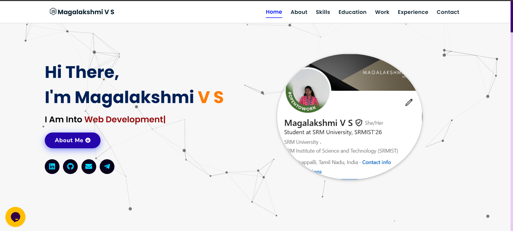

Portfolio Website

This is my personal portfolio website, showcasing my journey, skills, and projects as a final-year Computer Science student with hands-on experience in AR/VR, full-stack development, and machine learning.

About Me

I am passionate about innovation in technology and enjoy building impactful, user-friendly solutions. My work spans from interactive AR/VR applications to end-to-end web solutions and data-driven machine learning models. I focus on problem-solving, adaptability, and continuous learning.

I am currently seeking internship and job opportunities where I can apply my skills, collaborate with teams, and contribute to real-world solutions.

Tech Stack

Frontend: HTML, CSS, JavaScript

Backend: Node.js, Express.js, React.js

Database: MongoDB, MySQL

Other: AR/VR (Unity, ARKit), Machine Learning (Python)

Sections in Portfolio

About Me – Who I am and what I do

Projects – A showcase of AR/VR, full-stack, and ML work

Contact – Ways to reach me

Preview

## Screenshot

Contact Me

Email: your-magalakshmi12e32@example.com

LinkedIn: https://www.linkedin.com/in/magalakshmi-v-s-16371a250

GitHub: https://github.com/Magalakshmi-VS
